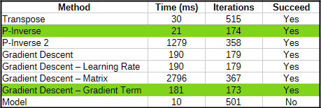
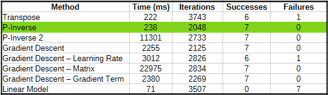
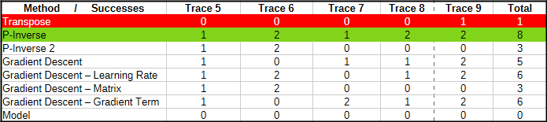
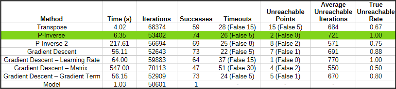
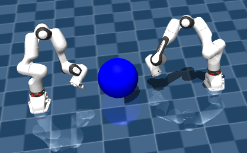

# **Comparing Inverse Kinematics Methods for Robotic Arm Control**

## **1 Abstract**

## **2 Background and Motivation**

Fundamentally, the tasks a robotic arm must complete involve the positions of the end effector in 3-dimensional space. In most applications, a set of desired end effector orientations will likely be supplied too. For simplicity, we only consider absolute end effector position, and leave orientation as an extension for future work - in particular, the methods we investigated will still hold when orientation is handled. Also, by only considering position, there is more redundancy: 7 degrees of freedom are used to reach a location given as (x, y, z). This arm is more agile and capable in comparison to arms with fewer joints, though this can come at the expense of encountering additional numerical issues. 

The high-level problem becomes transforming a desired position in physical 3-dimensional space to a set of joint positions (in our case, 7, since we use a robotic arm with 7 degrees of freedom) through inverse kinematics. There are numerous established methods for this, this is a widely studied and surprisingly difficult numerical problem. 

We seek to implement these strategies, and extend them to attempt to correct for singularities and poor numerical behaviors, and compare their performance. With the availability of many methods, it is valuable to see which is most optimal for a general application so that they do not all need to be tested. 

## **3 Platform and High-Level Organization**

### **3.1 Platform:**

We use the open-source MuJoCo (Google DeepMind) environment for simulating the robotic arm and readily obtaining the Jacobian. Though a physical simulation is not strictly necessary, it is useful for observing the general sequence of joint positions taken when converging to a final solution. In practical applications, the joint positions are computed and then the robot will move to them, and the solving trajectory is not seen. However, it can be useful to visually assess a trajectory for instability and oscillations. 

We use an XML model of the Franka FR3 arm with 7 degrees of freedom, constructed by Google Menagerie using available specifications from Franka. This is a fairly generic arm with 7 degrees of freedom and position redundancy.

**Figure 3.1: The Franka FR3 arm after being instructed to move to (0.4, 0.4, 0.4)**

### **3.2 Organization:**
On a high-level, there are four important program routines:

- **A control routine:** The control routine mimics the general manner an arm would be used. It is generic, and can utilize any of the 8 solving methods, and repeatedly prompts the user for positions that the arm must move to. This also enables the user to specify whether the arm should return to its home position after each failed request to help prevent convergence problems. 
- **A data collection routine:** The data collection routine randomly moves the arm and collects joint and end effector positions to fit a set of linear models for mapping 3-d positions to joint angles. 
- **A routine for having 2 robot arms pass a sphere between each other:** This routine is included as an application to verify the performance of the basic gradient descent method, and use it in a cooperative setting. 
- **A method testing routine:** The testing routine runs the 8 core methods on a set of position traces, and reports statistics for each. 

### **3.3 Modularity and Extensibility:**

Numerous Python modules are used to separate different project components and promote code reuse. It is simple to add additional inverse kinematics methods, and the core solving functionality is placed in modules. 

## **4 Basic Solving Methods**

We note four methods - three valid, Jacobian-based solvers, and an experimental approach based on 7 separate linear models. 

### **4.1 Jacobian-Based Methods**

The classical inverse kinematics methods appear to be generally based on using the Jacobian, and performing joint position updates until the end effector reaches the target. This is assessed by computing the deviation, and determining if it is within a small threshold. 

### **4.1.1 Using the Jacobian for Arm Movement**

The Jacobian measures the derivative of the x, y, and z components and 3 orientational angles of the end effector position with respect to each joint position. Thus, we have a link between the deviation from desired output end effector positions and viable updates in the joint positions to reduce end effector position error. The Franka FR3 arm will have a full Jacobian with dimensions $6 \times 7$, but we only use the upper $3 \times 7$ portion since we only consider end effector position.  

At each solver iteration, we attempt to solve $J*\vec{dj} = \vec{dx}$ for $\vec{dj}$, where $J$ is the current Jacobian, $\vec{dj}$ is the vector of joint position updates, and $\vec{dx}$ is the current position error. Specifically, $\vec{dx} = \vec{target} - \vec{cur}$, where $\vec{target}$ is the desired position in 3-d space, and $\vec{cur}$ is the current end effector position. Once we obtain these joint angle updates, we add them to the current joint positions to yield the new target joint positions. 

If the Jacobian were an invertible, square matrix, then we would have $\vec{dj} = J^{-1}*\vec{dx}$. However, since it is not square in our case, our key task becomes finding either an approximation for $J^{-1}$ or directly finding an optimal solution to the equation. 

Multiple iterations of this procedure are needed since the Jacobian changes depending on joint positions, and the updates on each iteration occur based on a singular Jacobian. Thus, our update after each step will not precisely lead to the desired end effector position.    

#### **4.1.1.1 Unreachable Position Detection**

When running the raw stepping method using the Jacobian, it is possible that the end effector position error will never be within the desired threshold. Thus, we can implement a feature to check the rate of change in position error. Once it falls below some threshold, we assume that the arm will not reach the target, and thus inform the user and prompt for a new arm position. 

At each iteration, we assess the proportional change in squared error from the previous iteration, relative to the current error. If this proportion is less than a small constant, then the number of consecutive improvement failure iterations is incremented, and otherwise this count is reset. If this count reaches a specific number of iterations (200, though this can be tuned further), then a position has been determined to be unreachable since the arm is making minimal proportional progress towards the solution. 

Previously, the unreachability detection algorithm simply assessed the change in error relative to a threshold, leading to poor detection due to a very low threshold, to prevent excessive false classifications. With the current algorithm, when overall error is small, a smaller error change is needed to trigger a detected failure, reducing misclassifications that occur when the arm will actually reach the target position, as desired. 

#### **4.1.1.1 Iterations and Simulator Usage**

In our usage of the MuJoCo simulator, on each solver iteration the simulation makes one step, which will perform a position update. As a note, this will only partially move the arm to the joint positions commanded based on the internal stepping logic of the simulator. 

It is possible to allow the arm to fully move to the target positions, but this leads to less frequent updates of the Jacobian. In an application with a physical robot arm, it is likely that we would use the full joint position updates, and would be able to manually compute the Jacobian for these joint positions, independent of any robot arm or simulation.

This detail does not affect the primary goal of our analysis, but it important to note. 

### **4.1.2 Method 1: Jacobian Transpose**

As noted by Buss and Kim, we can use the transpose of the Jacobian to approximately solve the core equation $J*\vec{dj} = \vec{dx}$ for $\vec{dj}$, yielding $\vec{dj} = J^T*\vec{dx}$. 

The transpose is a simple and numerically safe operation, but it is only an approximation of the inverse of the Jacobian. Nevertheless, it is decent efficacy, as seen in Chapter 6, since updates reduce the error in end effector position (Buss and Kim).  

### **4.1.3 Method 2: Jacobian Pseudoinverse**

Trivially, since the Jacobian matrix $J$ in $J*\vec{dj} = \vec{dx}$ for $\vec{dj}$ is not invertible, we can use the pseudoinverse as a better approximation than the Jacobian. Then, our approximate solution for $\vec{dj}$ is $pinv(J)*\vec{dx}$, and we can use this to update the current joint positions. We use numpy's linalg.pinv method for this.

One possible issue with this method is that numerical problems can be encountered while computing the Pseudoinverse, in contrast to the transpose being safe.  

### **4.1.3 Method 3: Jacobian Gradient Descent**

We can also use gradient descent to find an approximate least-squares solution to the equation $J*\vec{dj} = \vec{dx}$, minimizing   $||J*\vec{dj}-\vec{dx}||^2$. 

We must perform gradient descent multiple times while converging to an overall joint angle solution to reach a given end effector position. We consider the updates to the actual joint positions to be outer steps or iterations, and each step of minimizing   $||J*\vec{dj}-\vec{dx}||^2$ by computing the gradient and updating $\vec{dj}$ to be inner iterations or steps.

Our initial guess for $\vec{dj}$ is the zero vector due to continuity. Attempting other initial updates led to poorer performance, since more complicated solutions might be found, and more singularities could be encountered. However, if we had a better, safe approximation, we could use it, as noted in Section 8.2. 

#### **4.1.3.1 Fine-Tuning Gradient Descent Parameters**

We consider the case of solving the inverse kinematics problem for the desired position (0.4, 0.4, 0.4), using a position threshold of 0.00008, and starting from the default joint angles. As a note, our later, in-depth analysis is performed with a threshold of 0.0008 for more tolerance, leading to differences in iteration counts. 

 First, we optimize the number of internal steps for each usage of gradient descent by minimizing total steps (the product of the number of outer iterations and the inner gradient descent iterations). We observe that from the sampled values, the optimal inner step count is 60, at which there are 76800 total steps. 

**Figure 4.1: Total steps as a function of inner gradient descent iterations**

Using a fixed internal step count of 60, we then optimize the learning rate by observing the total number of outer iterations needed. We then find that with a learning rate of 0.89, there are 250 steps, corresponding to an approximate minimum. This is a significant improvement in comparison to the nearly 1500 steps used when the learning rate is under 0.1. 

**Figure 4.2: Outer gradient descent iterations as a function of learning rate**

Thus, we use an internal step count of 60 and a learning rate of 0.89 for optimal inverse kinematics solution convergence. These carefully tuned parameters may explain, at least in part, the high efficacy of the pure gradient-descent based approach, as detailed in Chapter 6. 

### **4.2 Method 4: Inverse Kinematics with a Set of Linear Models**

As an experiment, we consider a set of 7 linear models mapping 3-d coordinates to joint positions. During the data collection routine, each data point has 3 end effector coordinate components and 7 joint positions. 

We then fit 7 linear models, $LM_1$ to $LM_7$, where $LM_i$ is a mapping from $x$, $y$, and $z$ to $j_i$, where $j_i$ is the $i^{th}$ joint angle. Thus, each model $LM_i$ has the form $j_i = a_i*x+b_i*y+c_i*z+d_i$, where $a_i$, $b_i$, $c_i$, and $d_i$ are constants. 

To tune each linear model, we use gradient descent to minimize the sum of the squared errors between the predicted and actual joint angle for each data point. 

Finally, given a desired position $(x, y, z)$, we compute the output of each linear model to obtain the target joint positions. 

This approach has major limitations, since the forward mapping from joint angles to end effector positions is nonlinear, and thus the reverse mapping would not be expected to be linear. 

However, there are many improvements that can be made to this approach, and this is detailed in Section 8.1. In testing this method, it is apparent that there is a broad information gain related to the inverse kinematics of the arm, and with modifications it could be significantly more effective. 

## **5 Additional Solving Methods and Interventions**

We consider several additional methods and interventions to help avoid handle singularities. 

### **5.1 Method 5: Modified Pseudoinverse**

It is often undesirable to have matrices with small absolute determinants, and this can be associated with instability and rows or matrix columns that are close to multiples of each other, even if the rank is full. Thus, as an intervention, we adjust the matrix $J^T*J$ and manually compute the pseudoinverse instead of using numpy's linalg.pinv method. 

The base algorithm used for the pseudoinverse would be $(J*J^T)^{-1}*J^T$ (Wikipedia). However, the determinant of $M=J*J^T$ may be close to 0, and numerical issues may occur when computing the inverse. Thus, we adjust this matrix by repeatedly adding scalar multiples of the identity matrix to it (pseudocode below). This method could be improved by determining an appropriate scalar multiple by analyzing the eigenvalues of the matrix.  

**while** $abs(det(M)) < k1$  
&nbsp;&nbsp;&nbsp;&nbsp;&nbsp; $M = M + k2*I$

Assuming this adjustment occurs $n$ times, the adjusted matrix is then $M+k2*n*I$, which is equivalent to $J*J^T+k2*n*I$ by substitution. Thus, our corrected pseudoinverse becomes $(J*J^T+k2*n*I)^{-1}*J^T$. This result is used in place of the standard pseudoinverse.  

### **5.2 Method 6: Modified Gradient Descent: Learning Rate Adjustment**

Using the algorithm to detect potential singularities, on each iteration, if we detect a proportionally low decrease in error, we increase the learning rate from 0.89 to 1.8. This is motivated by the idea that the adjustment could help the gradient descent algorithm escape from a region that will not allow for the target position to be reached. 

We also attempted to increase the multiplier for the joint position updates instead of this, but found that instability increased excessively for some reachable points, and that this was not always sufficient as a singularity avoidance method for other locations. 

### **5.3 Method 7: Modified Gradient Descent: Matrix Adjustment**

The general equation to solve is $J*\vec{dj} = \vec{dx}$, as noted earlier. As inspired by the Levenberg-Marquardt algorithm, we can consider $J^T*J$ and perform corrections to this, as in method 5. 

We transform $J*\vec{dj} = \vec{dx}$ into $(J^T*J)*\vec{dj} = J^T*\vec{dx}$ by left-multiplying by $J^T$, and modify $(J^T*J)$ into $adj$ to ensure that it meets the determinant threshold. This perturbation is expected to help prevent numerical instability and can help potentially escape singularities.  

Then, we use gradient descent with a fixed number of steps to solve $adj*\vec{dj} = J^T*\vec{dx}$ for $\vec{dj}$ by minimizing squared error. At each step, we compute the gradient with respect to $\vec{dj}$, and perform an update.   

Other matrix adjustment schemes were also attempted. For example, the update rule $new = (old+k_1)*k_2$ for constants $k_1$ and $k_2$ was for main diagonal entries was used. However, when running an extensive test over 102 target positions, there were 44 false timeouts (exceeding the maximum iteration count when a position is actually reachable) as opposed to 30 false timeouts. Even though this method appeared to reduce convergence iterations in simple cases, it actually led to poorer overall performance. 

### **5.4 Method 8: Modified Gradient Descent: Gradient Adjustment**

To improve convergence, we can change the minimization objective by also considering the squared magnitude of the joint position update vector, $||\vec{dj}||^2$.

Thus, we minimize $||J*\vec{dj}-\vec{dx}||^2 - c*||\vec{dj}||^2$ for a small positive coefficient $c$, to increase $||\vec{dj}||^2$ of the computed vector $\vec{dj}$. This leads to a slightly different gradient resulting in more aggressive, but still smooth, joint position updates. 

This modification is the result of a different consideration that led to performance losses. 

When controlling a redundant robotic arm, it is considered optimal to choose the joint angle solution that has the least overall deviation from the initial starting arm position. Thus, instead of simply minimizing the squared error $||J*\vec{dj}-\vec{dx}||^2$ when solving $J*\vec{dj} = \vec{dx}$, we could minimize $||J*\vec{dj}-\vec{dx}||^2 + k*||\vec{dj}||^2$ for a small, positive constant $k$. However, this approach actually led to slower convergence by reducing joint position magnitudes, instead of leading to potential exploration of other solutions. It appears that to attempt to find other solutions, different initial starting vectors for $\vec{dj}$ would be needed. 

As a result, we attempted using a negative coefficient $k$ to to improve convergence by increasing joint position updates at each iteration, and found performance benefits.

### **5.5 Home Position Intervention**

In the main control routine, we allow for the arm to return to a home position after each failed motion attempt. Most failed cases arise from the arm being in strange orientations after attempting to move to an unreachable position. Thus, as an intervention, returning to a safer position can lead to higher overall efficacy for movement requests that follow an unreachable position. The position the arm moves to allows for reliable motion to reachable points, and based on tests singularities are generally not encountered. 

As a note, this is not considered to be a specific method - instead it is is a fix applied at the end of each failed motion request.

**Figure 5.1: The Franka FR3 arm in a mostly neutral position**

## **6 Analyzing The Inverse Kinematics Methods**

### **6.1 Testing Framework, In-Depth**

To assess the methods, we use the fourth high-level program option for testing. We use 10 different traces with varying purpose for an overall investigation of the 8 different methods. 

Each method is used separately with each trace, with the option to reinitialize the simulation before each position request in the trace. 

The statistics we obtain for each method, per trace, are elapsed time, total outer iterations, success count, timeout count, number of points detected as unreachable, the average time and iterations to determine unreachability, and the number of false timeouts and unreachability detections. 

It is important to note that for the final, most exhaustive trace, we do not manually determine the reachability of each point. Instead, we rely on the algorithms to determine if a position is reachable. If at least one method leads to reaching the target position, then it is reachable, and otherwise it is unreachable. It is possible that this approach falsely misclassifies some positions as unreachable, but due to the varied behaviors of the algorithms and start from the home position before each iteration, we assume that this is not a problem, or will not substantially alter the results. 

### **6.1.1 Traces**

- **Trace 1** assesses basic functionality: moving to the valid point (0.4, 0.4, 0.4). We also investigate the solving trajectory taken by a selected portion of the methods for this trace. 
- **Trace 2** tests a sequence of 3 valid positions without resetting the arm
- **Trace 3** tests a sequence of 7 valid positions, without resetting the arm
- **Trace 4** tests sending the arm to the unreachable position (1, 1, 1), which is not
  far removed from the range of the arm. 
- **Traces 5-9** test sequences of mixed valid positions and unreachable positions, including ones that are very far from the arm (including (-90, -90, 90)). These positions can be filtered out, but they are used to test the robustness of the algorithms due to the potentially undesirable ending positions (based on singularities and end effector location relative to the next target point). For these traces, the arm is not reset after unreachable points. 
- **Trace 10** is the most extensive trace with the largest sample size. The arm is reset after each request, where x and y can be -0.7, -0.35, 0, 0.35, or 0.7, and z can be 0, 0.2, 0.4, 0.6, 0.8, or 1. Points that have a sum of their squared components exceeding 1.1 are not considered, since it is expected that they are out of bounds based on observations of position reachability. Regardless, 102 points are tested on each method, and there is a mix of reachable and unreachable points. Based on the results from the arms, there are 79 valid points, and 23 unreachable points. For example, the position (0.7, 0.7, 0) is included, and it is not reachable. 

 

### **6.2 Method Assessment and Results**

**Trace 1:** All approaches except the set of linear models pass this trace. 

**Figure 6.1: Trace 1 statistics**

The raw pseudoinverse method has the best runtime and the second-lowest iteration count. Though gradient descent with a gradient modification leads to 1 less outer computation iteration, it is almost 9 times slower. The two methods that adjust $J^T*J$ are over 60 times slower than the fastest valid method, with no benefit in this case. This is expected since the simplest methods should be the fastest, and still converge well for a simple case. 

As expected, the linear model fails to yield a valid solution. In fact, the average error in the x, y, and z directions is approximately 0.17 (each target position is 0.4). 

For the movement to the point (0.4, 0.4, 0.4), we also visually analyze the solver trajectories. To indicate correctness, we use a small sphere to designate the target position. As this is an addition only for documentation, this modification was only temporarily in place. 

<video controls width = 600 src="https://cloudwolf021.github.io/Arm-Control/Graphics/transpose.mp4"></video>

**Figure 6.2: Inverse Kinematics with the Jacobian transpose - [Arm](https://cloudwolf021.github.io/Arm-Control/Graphics/transpose.mp4)**

---

<video controls width = 600 src="https://cloudwolf021.github.io/Arm-Control/Graphics/pinv.mp4"></video>

**Figure 6.3: Inverse Kinematics with the Jacobian pseudoinverse - [Arm](https://cloudwolf021.github.io/Arm-Control/Graphics/pinv.mp4)**

---

<video controls width = 600 src="https://cloudwolf021.github.io/Arm-Control/Graphics/pinv2.mp4"></video>

**Figure 6.4: Inverse Kinematics with the modified Jacobian pseudoinverse - [Arm](https://cloudwolf021.github.io/Arm-Control/Graphics/pinv2.mp4)**

---

<video controls width = 600 src="https://cloudwolf021.github.io/Arm-Control/Graphics/gradientDescent.mp4"></video>

**Figure 6.5: Inverse Kinematics with Gradient Descent and the Jacobian - [Arm](https://cloudwolf021.github.io/Arm-Control/Graphics/gradientDescent.mp4)**

---

<video controls width = 600 src="https://cloudwolf021.github.io/Arm-Control/Graphics/gradientDescentMatrixAdj.mp4"></video>

**Figure 6.6: Inverse Kinematics with Gradient Descent and a matrix adjustment  - [Arm](https://cloudwolf021.github.io/Arm-Control/Graphics/gradientDescentMatrixAdj.mp4)**

---

<video controls width = 600 src="https://cloudwolf021.github.io/Arm-Control/Graphics/gradientDescentGradientAdj.mp4"></video>

**Figure 6.7: Inverse Kinematics with Gradient Descent and a gradient adjustment - [Arm](https://cloudwolf021.github.io/Arm-Control/Graphics/gradientDescentGradientAdj.mp4)**

Using the pseudoinverse, pure gradient descent, or gradient descent with a modified gradient lead to the most direct trajectories. The gradient descent modification leads to faster convergence close to the solution, and has slightly better performance in comparison to regular gradient descent. 

-----------------------

**Trace 2:** All methods except the linear model set pass this trace with 3 valid position commands. As in the previous case, the pseudoinverse is the fastest at 73 ms and 640 iterations, and the gradient descent with a modified gradient has 633 iterations but a runtime of 663 ms.

-----------------------

**Trace 3:** This longer trace of 7 reachable positions leads to the transpose and gradient descent with a modified learning rate failing on 1 position each. 

**Figure 6.8: Trace 3 statistics**

Based on this trace, it becomes clear that the raw pseudoinverse approach leads to the best performance - it reaches all positions and runs almost 10 times as fast as the second-fastest method that reaches all targets (gradient descent). Though the transpose is faster, it is clear that it is less precise as an approximator for the joint position updates. 

-----------------------

**Trace 4:** The target position (1, 1, 1) is unreachable, and trivially no methods allow the arm to reach it. However, the modified Jacobian pseudoinverse method and the transpose method detect that the point is not reachable, and report this in approximately 700 iterations. This is beneficial over a timeout since less time is used and there is a stronger prediction that the position is actually unreachable (when not considering other knowledge about reachable positions).

-----------------------

**Traces 5-9:**

**Figure 6.9: Traces 5-9 statistics**

It is clear that the basic pseudoinverse method continues to perform the best. Furthermore, the transpose method is clearly the most ineffective at handling singularities (excluding the linear model set). However, the gradient descent methods with gradient correction and learning rate adjustment had 6 successes, which is better than the base gradient descent method. This indicates that in some cases, the interventions can be beneficial. Also of note is that the gradient term intervention method performed the best on trace 7, and that out of 10 reachable positions, the maximum reached was 8. This indicates that none of the methods universally work, and that some will be more successful in specific cases. 

-----------------------

**Trace 10:**

Finally, we consider the results of running the different approaches on the most extensive test set. 

**Figure 6.10: Trace 10 statistics**

The collected results indicate that the raw pseudoinverse method is optimal, with 74 out of 79 reached positions. With a runtime of 6.35 seconds, this is the second-fastest of the methods with reasonable accuracy. 

Gradient descent and gradient descent with a modified gradient are comparable, and both correctly obtained 73 of the target positions, but with runtimes over 56 seconds - almost 10 times slower than the pseudoinverse approach. 

The adjusted pseudoinverse method and gradient descent with a modified gradient are unacceptably slow, though the adjustment algorithm can be greatly improved. However, these interventions also lead to clear correctness losses. 

One shortcoming of the pseudoinverse routine is that it only detected 2 out of 23 unreachable points, with a 1.00 true positive rate, while the transpose method correctly detected 10, but with a true positive rate of only 0.67. Nevertheless, neither of these methods can be fully relied upon for determining unreachability. 

The number of iterations until a point is detected as unreachable is fairly uniform across the different approaches, though the matrix-based interventions have lower iteration counts near 550. 

This test also confirms the infeasibility of using a set of linear models for inverse kinematics, with only 1 observed success for this approach. 

## **7 Application: Two Robotic Arms Repeatedly Pass a Sphere To Each Other**

We consider a secondary setup with two identical Franka FR3 robotic arms, where the goal of each arm is to repeatedly pass a ball/sphere to the other arm. As part of this, it is important for the two arms to keep the ball in their reach. This serves as a test for the inverse kinematics method using gradient descent, and cooperative robotics experiment. 

**Figure 7.1: The setup with two robotic arms and a sphere**

Initially, the end effector of the arms was instructed to go to the center of the sphere. This would generate excessive contact forces, and the ball would move to quickly. As a result, an offset was added so that the end effector does not move the sphere as harshly.

To prevent the ball from moving out of reach of the arms, a corrective motion for pushing the ball back towards the centerline was added. When the sphere has deviating significantly from the central plane ($x=0$), the arms reach a position more laterally outwards relative to the sphere, and then move inwards to apply a corrective force on the ball. In the example provided, the second arm performs successfully performs this routine.  

<video controls width = 800 src="https://cloudwolf021.github.io/Arm-Control/Graphics/dualArms.mp4"></video>

**Figure 7.2: Arms passing a sphere between each other - [Arms](https://cloudwolf021.github.io/Arm-Control/Graphics/dualArms.mp4)**

This indicates that the gradient descent method works well for this application, and leads to smooth arm motions. 

## **8 Future Work**

### **8.1 Linear Model Set Improvements**

The current set of linear models used for inverse kinematics in Method 4 works very poorly, as shown by 1 success over 79 different reachable positions. It only considers linear relationships, and performs multiple linear regression separately for the different joint positions. This cannot accurately learn the true kinematics of the arm, and serves as a test. In the future, we can construct a single nonlinear model (with x, y, z as inputs and 7 joint positions as outputs). Alternatively, as suggested by Professor Chris Atkeson, subdividing the 3-d space into segments and making multiple local models would be an even more ideal modification. 

### **8.2 Method Combinations**

Multiple methods can be combined to yield faster convergence. For example, the transpose operation is numerically safe, but leads to poorer overall performance. Thus, the joint update vector outputted by this method could be used as the starting point for gradient descent, for better runtime and potentially more robustness. 

### **8.3 Considering Arm Orientation**

Extending the state inputs so that the orientation of the arm is also considered would be more universally applicable. This will involve using the angular portion of the Jacobian and also taking three additional inputs that determine end effector orientation. In practice, this is quite useful since the end effector of an arm will often need to be in some particular orientation once it reaches the target (x, y, z) point.

### **8.4 Better Singularity Detection**

Currently, it is somewhat difficult to detect when the arm has encountered a true singularity and will likely not reach its target. The algorithm used that investigates consecutive change in error proportional to absolute square error can lead to false detections of unreachability in the case that a singularity is encountered, and a position is actually reachable. Fitting a classification model based on square error and change in squared error could lead to better detection, and allow for more aggressive adjustments to when needed. Currently, substantial adjustments in cases where there are no singularity-related issues can lead to commands to easily reachable positions failing. 

### **8.5 Better Unreachable Position Detection**

Finally, filtering out unreachable positions without attempting to move to them could reduce the numerical issues we encounter. Training another classification model to determine whether (x, y, z) points are reachable could be needed since the reachable point cloud will likely not have a clean form for the Franka FR3 arm. 

## **9 Conclusion**

We have found that the core inverse kinematics solving methods work relatively well in most cases. However, oscillations and poor convergence can still occur. Numerous interventions were attempted, but as a whole they appear to actually hurt performance. In certain cases, such as trace 7, they are clearly beneficial, but using pure gradient descent and an unmodified pseudoinverse generally leads to the best performance performance in terms of correctness. The gradient descent approach using a modified gradient is comparable to basic gradient descent, though. The pseudoinverse algorithm is almost 10 times faster than gradient descent, and as a whole appears to be the best method. 

As a whole, this confirms that the simplest method is optimal, indicating that other methods may need to be significantly more robust to outperform the pseudoinverse. 

It may be also possible to use a tiered method system: if a specific position request leads to a failure when the pseudoinverse approach is used, we can attempt using a version of gradient descent. 

There are many algorithmic improvements that can be made to improve the accuracy of inverse kinematics solving. A core idea will likely be combining multiple approaches and making use of trained neural networks to help with unreachability and singularity detection. This combined with the basic methods should lead to both correctness and runtime gains. 

## **10 Acknowledgements**

Thank you to Professor Chris Atkeson and Henry Liao for the project advice and change towards assessing and applying different inverse kinematics methods.

## **11 Sources**

1. Buss and Kim. https://www.cs.cmu.edu/~15464-s13/lectures/lecture6/iksurvey.pdf (2009). This paper introduction gives more context for using the Jacobian to iteratively step joint positions to converge to the target position. 

2. https://en.wikipedia.org/wiki/Levenberg%E2%80%93Marquardt_algorithmas an inspiration for one of the intervention methods.

3. https://github.com/openai/mujoco-py/issues/10 for helping determine how to adjust the camera elevation to help properly show the target. 

4. https://www.markdownguide.org/hacks/ and https://www.markdownguide.org/basic-syntax/ for syntax help.

5. https://www.markdownguide.org/basic-syntax/ for syntax help.

 &nbsp;&nbsp;&nbsp;&nbsp;&nbsp; ***Note***: Other helper sources are listed throughout the code, and are omitted   &nbsp;&nbsp;&nbsp;&nbsp;&nbsp; here since they are not directly related to the core analysis and method logic. 

