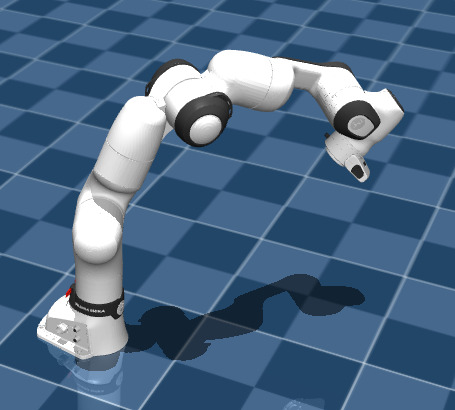
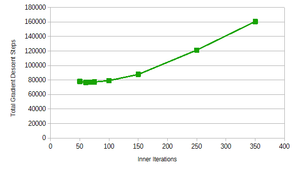
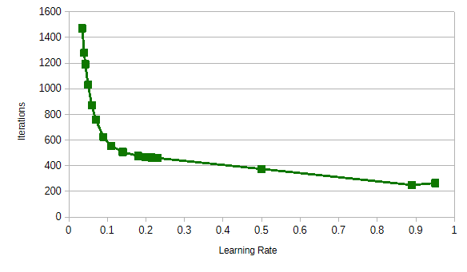
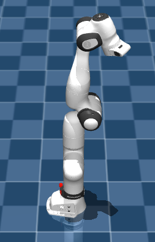

# **Comparing Inverse Kinematics for Robotic Arm Control**

## **1 Abstract**

## **2 Background and Motivation**

Fundamentally, the tasks a robotic arm must complete involve the positions of the end effector in 3-dimensional space. In most applications, a set of desired end effector orientations will likely be supplied too. For simplicity, we only consider absolute end effector position, and leave orientation as an extension for future work - in particular, the methods we investigated will still hold when orientation is handled. Also, by only considering position, there is more redundancy: 7 degrees of freedom are used to reach a location given as (x, y, z). This arm is more agile and capable in comparison to arms with fewer joints, though this can come at the expense of encountering additional numerical issues. 

The high-level problem becomes transforming a desired position in physical 3-dimensional space to a set of joint positions (in our case, 7, since we use a robotic arm with 7 degrees of freedom) through inverse kinematics. There are numerous established methods for this, and this has been a heavily studied problem. 

We seek to implement these strategies, and extend them to attempt to correct for singularities and poor numerical behaviors, and compare their performance. With the availability of many methods, it is valuable to see which is most optimal for a general application so that they do not all need to be tested. 

## **3 Platform and High-Level Organization**

### **3.1 Platform:**

We use Google DeepMind's open-source MuJoCo environment for simulating the robotic arm and readily obtaining the Jacobian. Though a physical simulation is not strictly necessary, it is useful for observing the general sequence of joint positions taken when converging to a final solution. In practical applications, the joint positions are computed and then the robot will move to them, and the solving trajectory is not seen. However, it can be useful to visually assess a trajectory for instability and oscillations. 

We use an XML model of the Franka FR3 arm with 7 degrees of freedom, constructed by Google Menagerie using available specifications from Franka. This is a fairly generic arm with 7 degrees of freedom and position redundancy.

**Figure 3.1: The Franka FR3 arm after being instructed to move to (0.4, 0.4, 0.4)**

### **3.2 Organization:**
On a high-level, there are four important program routines:

- **A control routine:** The control routine mimics the general manner an arm would be used. It is generic, and can utilize any of the 8 solving methods, and repeatedly prompts the user for positions that the arm must move to. This also enables the user to specify whether the arm should return to its home position after each failed request to help prevent convergence problems. 
- **A data collection routine:** The data collection routine randomly moves the arm and collects joint and end effector positions to fit a set of linear models for mapping 3-d positions to joint angles. 
- **A routine for having 2 robot arms pass a sphere between each other:** This routine is included as an application to verify the performance of the basic gradient descent method, and use it in a cooperative setting. 
- **A method testing routine:** The testing routine runs the 8 core methods on a set of position traces, and reports statistics for each. 

### **3.3 Modularity and Extensibility:**

Numerous Python modules are used to separate different project components and promote code reuse. It is simple to add additional inverse kinematics methods, and the core solving functionality is placed in modules. 

## **4 Basic Solving Methods**

We note four methods - three valid, Jacobian-based solvers, and an experimental, model-based approach.

### **4.1 Jacobian-Based Methods**

The core problem is .....
Iterate...

It was found that having multiple iterations of the simulation at each step led to higher numbers of total motion iterations needed, since computing update joint positions more times leads to less deviation in the Jacobian matrix. 

4/56
3/74
2/110
1/218

@@ Note in extension -> this constraint comes from the framework. 

When running the raw stepping method using the Jacobian, it is possible that the end effector position error will never be within the desired threshold. Thus, we can implement a feature to check the rate of change in position error. Once it falls below some threshold, we assume that the arm will not reach the target, and thus inform the user and prompt for a new arm position. 

### **4.1.1 Using the Jacobian for Arm Movement**

The Jacobian is a very important matrix that measures the derivative of the x-y-z components of the end effector with respect to each joint position, as well as the change in angles.

Thus, we have a link between the deviation from desired output end effector positions and viable updates in the joint positions to reduce end effector position error. 

### **4.1.2 Method 1: Jacobian Transpose**

### **4.1.3 Method 2: Jacobian Pseudoinverse**

In particular, the Jacobian does not need to be square, and no true inverse likely exists. Furthermore, even if it is square, it is possible that it is non-invertible due to a nontrivial null space.

### **4.1.3 Method 3: Jacobian Gradient Descent**

#### **4.1.3.1 Fine-Tuning Gradient Descent Parameters**

We consider the case of moving from the initial, default upwards arm orientation to the (x, y, z) position of (0.4, 0.4, 0.4), using a position threshold of 0.00008.

The overall logic is a multi-level numerical problem. Internally, at each iteration, a rough update for the joint positions is obtained, and this routine is performed until the end effector is within the threshold of the target position. 

 First, we optimize the number of gradient descent iterations. 

There is a clear tradeoff between the number of iterations in the gradient descent loop at each outer step and the number of outer full position update steps that are run. However, to minimize overall computational work, we minimize the total number of steps, which is the product of the number of outer iterations and inner iterations. We observe that from the sampled values, the optimal inner step count is 60, with 76800 total steps. An intuitive explanation for this is that with more than 60 steps, the benefit from the better solution is not as significant, and that with less steps, there is not sufficient convergence towards a least-square solution for the desired joint angle updates. 

**Figure 4.1: Total steps as a function of inner gradient descent iterations**

Then, we expect that this result can translate to the use of other learning rates, and using 60 as the internal step count, we optimize the learning rate by observing the total number of external iterations needed. We then find that the minimum number of outer iterations needed is 250, with a learning rate of 0.89, which is substantially higher than the initial rate that was used. This indicates that the learning rate generally has a range of suitable values, and increasing it until some level leads to faster convergence without leading to instability.  

**Figure 4.2: Outer gradient descent iterations as a function of learning rate**

Thus, we use an internal step count of 60 and a learning rate of 0.89, which appears to lead to the fastest overall solution. It is possible that this tuning is an important factor in the high efficacy of the pure gradient descent method.  

### **4.2 Method 4: Model-Based Solving**

As a note, this approach can be improved, and this is detailed in Chapter 9. 

## **5 Additional Solving Methods and Interventions**

We consider several additional methods and interventions to help avoid handle singularities. 

### **5.1 Method 5: Modified Pseudoinverse**

### **5.2 Method 6: Modified Gradient Descent: Learning Rate Adjustment**

### **5.3 Method 7: Modified Gradient Descent: Matrix Adjustment**

### **5.4 Method 8: Modified Gradient Descent: Gradient Adjustment**

### **5.5 Home Position Intervention**

In the main control routine, we allow for the arm to return to a home position after each failed motion attempt. Most failed cases arise from the arm being in strange orientations after attempting to move to an unreachable position. Thus, as an intervention, returning to a safer position can lead to higher overall efficacy for movement requests that follow an unreachable position. The position the arm moves to allows for reliable motion to reachable points, and based on tests singularities are generally not encountered. 

As a note, this is not considered to be a specific method - instead it is is a fix applied at the end of each failed motion request.

**The Franka FR3 arm in a mostly neutral position**

## **6 Analyzing The Inverse Kinematics Methods**

### **6.1 Testing Framework, In-Depth**

To assess the methods, we use the fourth high-level program option for testing. We use 10 different traces with varying purpose for an overall investigation of the 8 different methods. 

### **6.2 Method Assessment and Results**

To assess the basic methods, we use a set of test routes between points in 3-dimensional space. We observe whether they successfully converge, how many total steps are used, and how smooth the algorithm until convergence. These methods do not account for singularities, and it is possible for them to fail. 

## **7 Application: Moving Sphere Between 2 Robotic Arms**

To test the inverse kinematics methods and experiment with cooperative arms, we consider a secondary setup. This utilizes two identical Franka FR3 robotic arms, and a sphere in-between them. The key task is for the two arms to properly move the sphere so that it does not move out of their reach, and for each robot to pass the ball to the other. 

Several iterations were needed until the ball would remain in reach of the two arms. In particular, the arms should not move to the center of the sphere, and if it is deviating significantly laterally, they must ensure to try to push it more towards the center (closer to x=0).

## **8 Conclusion**

We have found that the core inverse kinematics solving methods work relatively well in most cases. However, oscillations and poor convergence can occur in certain cases. Moreover, different methods and interventions do not uniformly help. Thus

## **9 Future Work**

- The current model used for inverse kinematics works very poorly (in trace 10, only 1 success for 79 different reachable positions). It only considers linear relationships, and performs multiple linear regression separately for the different joint positions. This cannot accurately learn the true kinematics of the arm, and serves as a test. In the future, a single, larger nonlinear model, or multiple local models can be made for this. Subdividing the 3-d space into segments and making models for each one should lead to a better understanding of the kinematics. As a further extension, the model could be used for obtaining an approximate set of joint positions, which are used as the starting point for gradient descent or one of the other iterative methods that were investigated. 

- Extending the state inputs so that the orientation of the arm is also considered would be more universally applicable. This will involve using the angular portion of the Jacobian and also taking three additional inputs that determine end effector orientation. In practice, this is quite useful since the end effector of an arm will often need to be in some particular orientation once it reaches the target (x, y, z) point.

- Currently, it is somewhat difficult to detect when the arm has encountered a true singularity and will likely not reach its target. The algorithm used that investigates consecutive change in error proportional to absolute square error can lead to false detections of unreachability in the case that a singularity is encountered, and a position is actually reachable. Fitting a classification model based on square error and change in squared error could lead to better detection, and allow for more aggressive adjustments to when needed. Currently, substantial adjustments in cases where there are no singularity-related issues can lead to commands to easily reachable positions failing. 

- Finally, filtering out unreachable positions without attempting to move to them could reduce the numerical issues we encounter. Training another classification model to determine whether (x, y, z) points are reachable could be needed since the reachable point cloud will likely not have a clean form for the Franka FR3 arm. 

## **10 Acknowledgements**

Thank you to Professor Chris Atkeson and Henry Liao for the project advice and change towards assessing and applying different inverse kinematics methods, with a focus on singularities.

## **11 Sources**

1. Buss and Kim. https://www.cs.cmu.edu/~15464-s13/lectures/lecture6/iksurvey.pdf (2009). This paper introduction gives more context for using the Jacobian to iteratively step joint positions to converge to the target position. 

2. https://en.wikipedia.org/wiki/Levenberg%E2%80%93Marquardt_algorithm. This is an inspiration for one of the intervention methods.

 *Note*: Other helper sources are listed throughout the code, and are not listed here since they are not directly related to the core analysis logic. 

